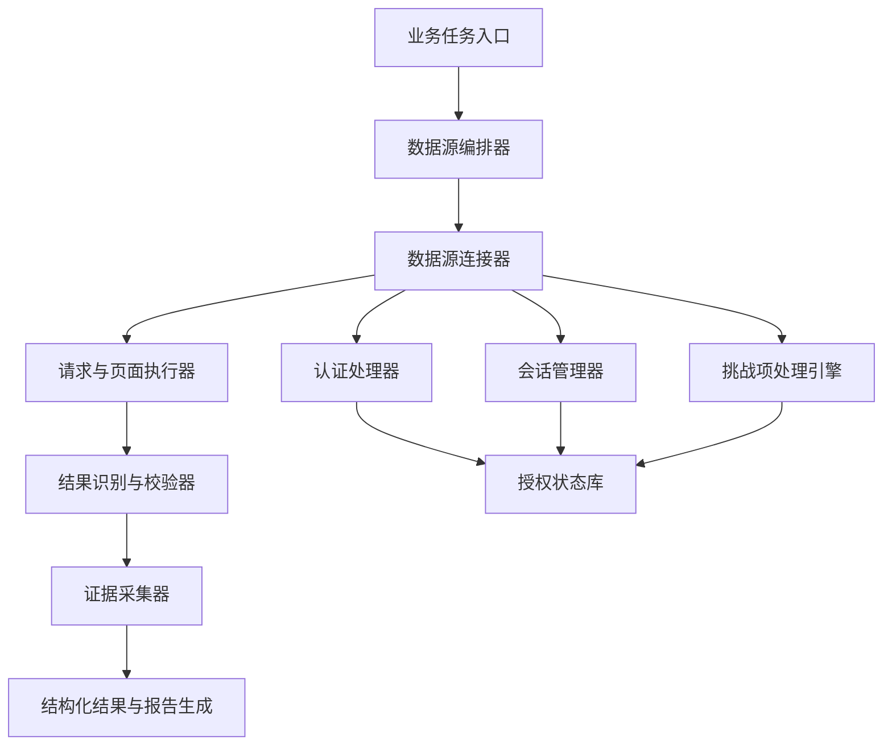

# 通用数据源接入框架产品架构方案

## 1. 背景与目标

企业级公开与授权数据源并不都是“打开页面、输入主体、直接返回结果”的简单模式。政务、司法、工商、金融、行业门户经常存在访问控制、授权会话、请求签名、令牌刷新、页面挑战项、动态页面加载等机制。

本框架的目标不是把每个网站写成一次性脚本，而是沉淀为一个可扩展的数据源接入底座。业务用户只需要输入企业名称、统一社会信用代码、法人、实控人等业务信息，系统负责打开数据源、保持授权会话、完成查询、校验真实结果页、采集截图证据并生成 Word 报告。

核心目标：

- 支持公开数据、授权数据、企业自有系统和用户有权访问的数据源。
- 支持网页门户、搜索引擎、API、文件下载、半结构化页面等多种形态。
- 内置认证、会话、令牌、签名、挑战项处理、重试、熔断、审计等通用能力。
- 面向非技术用户，做到“一句话输入主体，输出可下载报告”。
- 保留来源、时间、URL、截图、校验状态和异常说明，满足贷前贷后风控留痕要求。

## 2. 产品原则

### 2.1 用户无技术负担

用户不需要理解 Cookie、Token、Header、页面 DOM、接口签名等技术概念。系统以业务语言表达状态，例如：

- 正在连接中国执行信息公开网。
- 正在保持授权会话。
- 页面出现挑战项，正在进入托管确认流程。
- 已进入查询结果页。
- 未查到匹配记录，已保存无结果页证据。

### 2.2 数据来源合法可审计

框架只处理公开数据、授权数据、用户有权访问的数据。所有数据接入都必须保留来源信息和处理过程，不把未知来源、未授权来源、泄露数据作为产品事实。

### 2.3 自动化优先，合规适配访问控制

框架内置挑战识别、会话保持、重试、令牌刷新、授权流程自动化等能力。对允许自动处理的低风险场景，系统可自动完成；对司法、政务、执行等强校验场景，默认进入托管确认流程，并在授权会话有效后继续后续查询。

### 2.4 插件化扩展

每个数据源只描述“如何访问、如何查询、如何判断结果、如何留证”。认证、会话、挑战项处理、重试、截图、报告生成由框架统一提供，避免每接一个网站都重写一套流程。

## 3. 总体架构



核心模块：

- 业务任务入口：接收企业名称、统一社会信用代码、人员信息、查询范围等业务参数。
- 数据源编排器：按查询场景选择数据源，并控制执行顺序、并发、冷却和失败回补。
- 数据源连接器：封装单个数据源的查询逻辑。
- 认证处理器：统一处理登录、Token、签名、OAuth、Cookie 等认证机制。
- 会话管理器：维护浏览器会话、Cookie、Token 生命周期和自动刷新。
- 挑战项处理引擎：识别图像文字确认、滑块、短信、扫码、行为确认等挑战类型，并选择合规处理策略。
- 请求与页面执行器：统一执行网页自动化、HTTP 请求、下载、翻页、滚动、表单填写。
- 结果识别与校验器：判断页面是否为真实结果页、无结果页、登录页、异常页或挑战项页。
- 证据采集器：保存截图、HTML、URL、时间戳、输入参数和校验状态。
- 报告生成器：输出 Word、PDF 或结构化 JSON。

## 4. 统一认证处理器接口

```ts
export interface AuthHandler {
  id: string;
  type: "none" | "cookie" | "form-login" | "token" | "oauth2" | "signature" | "custom";
  detect(context: AuthContext): Promise<AuthState>;
  authenticate(context: AuthContext): Promise<AuthResult>;
  refresh?(context: AuthContext): Promise<AuthResult>;
  validate(context: AuthContext): Promise<AuthValidationResult>;
}
```

内置处理器：

- `NoAuthHandler`：无认证公开页面。
- `CookieAuthHandler`：复用已有浏览器授权会话。
- `FormLoginHandler`：表单登录流程。
- `TokenRefreshHandler`：Bearer Token、JWT 等令牌刷新。
- `SignatureRequestHandler`：按配置对请求参数、时间戳、Nonce 做签名。
- `HumanAssistedAuthHandler`：扫码、短信、二次确认等托管授权流程。

## 5. 挑战项处理引擎

挑战项处理引擎不是单点识别函数，而是统一的挑战分类、策略判断、托管确认、结果校验中心。它负责判断当前遇到的挑战类型、风险等级、是否允许自动处理、是否需要用户接管、处理后是否真正进入结果页。

```ts
export interface ChallengeHandler {
  id: string;
  supports(challenge: ChallengeContext): boolean;
  solve(challenge: ChallengeContext): Promise<ChallengeResult>;
  verify(challenge: ChallengeContext): Promise<ChallengeVerification>;
}
```

支持的挑战类型：

- 图像文字确认。
- 算术题、选择题等简单挑战项。
- 滑块、点选、旋转等交互式挑战项。
- 登录态二次确认。
- 短信、扫码、App 确认等强认证挑战项。
- 频控、风控、访问异常页。
- WAF、行为检测等安全网关。

默认策略：

| 场景 | 默认策略 |
| --- | --- |
| 普通公开站点的低风险图像文字确认 | 默认关闭自动识别，可在授权和合规配置下开启 |
| 用户自有系统或已签约授权系统 | 可配置自动识别、自动提交、失败重试 |
| 政务、司法、执行类强校验源 | 默认托管确认，系统预填主体并等待用户完成必要确认 |
| 短信、扫码、App 确认 | 用户完成一次授权，系统等待并继续 |
| 页面风控或访问异常 | 自动降速、重试、切换入口、记录异常 |
| 无法确认合法性的挑战项 | 阻断自动处理，输出风险说明 |

## 6. 会话管理与令牌刷新

会话管理器负责让系统像稳定的企业应用，而不是一次性脚本。

能力包括：

- 浏览器 Profile 隔离，不同业务场景使用不同会话空间。
- Cookie、LocalStorage、SessionStorage 的持久化与本地存储。
- Token 到期时间识别与自动刷新。
- 登录失效自动检测。
- 查询前预检认证状态。
- 查询中遇到登录页时进入托管恢复。
- 异常退出后可恢复上次任务。
- 多数据源并发访问时隔离会话，避免互相污染。

用户会话数据仅存储在本地机器，不会上传任何服务器。

## 7. 数据源连接器协议

```ts
export interface DataSourceConnector {
  id: string;
  name: string;
  category: "government" | "judicial" | "market" | "search" | "industry" | "custom";
  auth: AuthProfile;
  query(input: QueryInput, runtime: ConnectorRuntime): Promise<QueryResult>;
  validate(result: QueryResult): Promise<ValidationResult>;
  evidence(result: QueryResult): Promise<EvidencePackage>;
}
```

连接器配置示例：

```json
{
  "id": "china_enforcement",
  "name": "中国执行信息公开网",
  "category": "judicial",
  "auth": {
    "type": "human-assisted",
    "sessionReuse": true,
    "challengePolicy": "managed-confirmation-required"
  },
  "query": {
    "mode": "browser",
    "entryUrl": "https://zxgk.court.gov.cn/zhzxgk/",
    "fields": {
      "subjectName": "#pName",
      "certificateNo": "#pCardNum"
    }
  },
  "validation": {
    "mustReach": ["result-page", "no-result-page"],
    "reject": ["login-page", "challenge-page", "error-page"]
  }
}
```

## 8. 查询结果校验

企业级接入不能“截图了就算成功”，必须确认截图对应真实结果。

校验器需要识别：

- 结果列表页。
- 无结果页。
- 详情页。
- 登录页。
- 挑战项页。
- 网络异常页。
- 空白页。
- 首页但未查询。
- 表单已填写但未提交。

司法和执行信息为贷前贷后必查项。正式报告必须包含裁判文书和执行信息的真实结果页或无结果页证据；如未能完成，将标注为高风险并阻止正式交付。

## 9. 面向非技术用户的体验

用户侧流程应尽量简单：

1. 输入企业名称、法人、实控人或统一社会信用代码。
2. 系统识别主体并补全必要信息，必要时提示确认。
3. 系统访问所有必查数据源。
4. 如遇需要用户授权的挑战项，打开托管窗口，用户按页面提示完成一次操作。
5. 系统继续执行，不要求用户理解技术细节。
6. 输出 Word 报告、截图证据、结构化结果和审计日志。

前端文案不使用技术术语，例如不说“Cookie 失效”，而说“登录状态已过期，需要重新授权一次”。

## 10. 合规与风险控制

内置策略：

- 数据源必须标记来源类型：公开、授权、用户委托、内部系统。
- 每个挑战项处理器必须声明是否允许自动处理。
- 司法、执行、强风控站点默认禁用自动图像文字识别，进入托管确认。
- 用户自有系统、已授权系统可启用自动图像文字识别或 API 级认证。
- 所有人工接管、自动重试、失败原因必须留痕。
- 不保存不必要的个人敏感信息。
- 身份证号、Token、Cookie 等敏感数据按本地部署策略保护。
- 报告中保留查询时间、来源、URL、截图证据，避免口径不清。

## 11. 当前项目落地状态

已经落地：

- `framework/audit.js`：统一记录挑战识别、搜索源切换、任务开始/结束等审计事件。
- `framework/profile_manager.js`：隔离搜索、司法、政务门户浏览器 Profile。
- `framework/challenge_policy.js`：定义自动处理、托管处理、阻断处理三档策略。
- `framework/search_manager.js`：搜索引擎切换、冷却、主体匹配、前三页完整采集。
- `framework/judicial_sources.js`：司法门户挑战型数据源策略骨架。
- `framework/enforcement_source.js`：执行信息公开网专项模块，记录图像文字确认状态、隐藏字段、提交前状态、查询响应、结果确认。
- `framework/ocr_solver.js`：可选图像文字识别接口，默认关闭，仅在授权或低风险场景下启用。
- `runtime_policy.js`：浏览器兼容性调优参数默认关闭，用户可在高级配置中开启。

搜索模块策略：

- 搜索查询只使用主体全名，不添加额外关键词。
- 搜索源按可用性自动切换。
- 发现挑战项、异常流量、登录页后，当前搜索源进入冷却，不把异常页放入报告。
- 搜索证据必须完整取得同一搜索源前三页；如果中途异常，则不输出半截截图。
- 所有跳转和挑战识别写入 `audit-events.json`。

执行信息公开网专项策略：

- 记录图像文字确认图片 `src`、加载状态、尺寸、隐藏字段、输入框值。
- 记录图片截图 hash、图片坐标、输入框坐标、表单 action/method、查询按钮状态。
- 提交前后记录状态，用于判断前端展示与后端校验是否同一轮。
- 监听执行网相关网络响应，记录状态码、内容类型、响应片段。
- 必须确认进入结果页或无结果页状态后才截图。
- 当前默认仍为托管模式；自动图像文字识别作为策略开关预留，不默认用于司法强风控站点。

批量与后台执行策略：

- 批量查询输出一个批次文件夹，`reports` 仅放最终 Word 报告，`evidence` 放每家企业截图、manifest、审计日志。
- 批量脚本支持自动重试和失败回补，回补结果写回原批次目录。
- 医院/医疗机构卫健委查询采用属地优先；属地站点不可用或无主体结果时自动切换河南省卫健委。

## 12. 技术路线

参考方向：

- Playwright：浏览器上下文隔离、授权状态保存、locator、trace、自动等待。
- Puppeteer / Selenium：浏览器自动化和显式等待经验。
- Crawlee / Scrapy / WebMagic：任务队列、并发控制、自动限速、失败重试、熔断恢复。
- Robocorp / Robot Framework Browser：把浏览器、文件、表格、凭据等能力封装成业务动作。
- PaddleOCR / Tesseract / OpenCV：作为低风险图像文字识别和视觉处理的可选组件路线。

推荐实现顺序：

1. 完成 `SessionManager`：profile、storage state、登录态预检、过期检测。
2. 完成 `TaskQueue`：批量任务拆分、失败重试、按源限速、熔断。
3. 完成 `ChallengeDetector`：统一识别登录、挑战项、异常流量、结果态错判。
4. 完成司法门户 `assisted` 模式：系统填主体，用户必要时确认，系统校验结果并采证。
5. 完成图像文字识别插件化：接口兼容 PaddleOCR、Tesseract、本地可选增强组件。
6. 完成低风险 `auto` 模式：只对授权、内部、低风险源启用自动图像文字识别和自动重试。
7. 完成可观测性：每个挑战项、重试、熔断、人工接管都写入 `audit-events.json`。

## 13. 最小可交付版本

最小可交付版本至少包含：

- 统一数据源配置。
- 统一认证处理器接口。
- 统一挑战项处理接口。
- 浏览器会话复用。
- 结果页校验。
- 证据采集。
- Word 报告生成。
- 异常状态可解释。
- 默认合规策略。

## 14. 一句话定位

本框架是面向公开和授权数据源的企业级接入底座：它把认证、会话、挑战项处理、结果校验和证据留痕统一封装，让非技术用户也能稳定完成复杂数据源查询。
