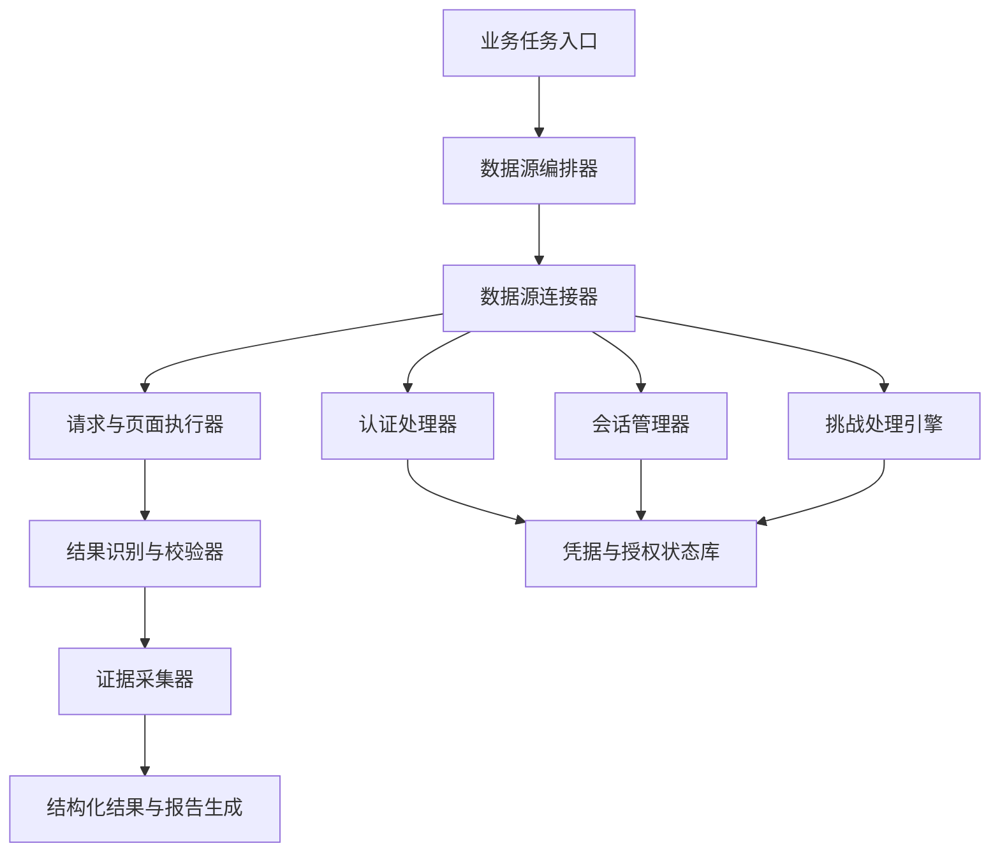

# 通用数据源接入框架产品架构方案

## 1. 背景与目标

企业级公开数据源并不都是“打开网页、输入关键词、直接返回结果”的简单模式。大量政务、司法、工商、金融、行业门户都会存在访问控制和安全校验机制，例如人机校验、会话认证、请求签名、令牌刷新、访问频控、动态页面加载等。

因此，贷前贷后查询系统不能只做成一组固定脚本，而应该沉淀为一个通用的数据源接入框架。业务人员只需要输入企业名称、统一社会信用代码、查询场景等业务信息，系统负责识别数据源类型、处理认证状态、保持会话、完成查询、校验结果页并生成证据材料。

本方案目标是建设一个面向非技术用户的、企业级的、可扩展的数据源接入底座：

- 支持公开或授权数据源的统一接入。
- 支持网页门户、搜索引擎、API、文件下载、半结构化页面等多种数据源形态。
- 原生支持认证、会话、令牌、签名、人机校验等复杂访问场景。
- 对用户隐藏技术复杂度，做到“输入业务对象，输出可用结果和证据链”。
- 保留来源、时间、截图、URL、校验状态、异常说明，满足贷前贷后风控留痕要求。

## 2. 产品原则

### 2.1 用户无技术负担

用户不需要理解 Cookie、Token、Header、验证码、页面 DOM、接口签名等技术概念。系统以业务语言表达状态，例如：

- “正在连接中国执行信息公开网”
- “正在保持登录状态”
- “页面出现安全校验，正在处理”
- “已进入查询结果页”
- “未查到匹配记录，已保存无结果页证据”

### 2.2 数据来源合法可审计

框架只处理公开数据、授权数据、用户有权访问的数据。所有数据接入都必须保留来源信息和处理过程，不把未知来源、非授权来源、泄露数据作为产品事实。

### 2.3 自动化优先，但不绕过访问控制

框架需要内置挑战识别、会话保持、重试、令牌刷新、授权流程自动化等能力。对于允许自动处理的校验，系统自动完成；对于明确要求人工确认或禁止自动破解的安全控制，系统进入托管式人工接管流程，并在后续复用合法会话，最大限度减少用户操作。

### 2.4 插件化扩展

每个数据源只描述“如何访问、如何查询、如何判断结果、如何留证”，认证、会话、挑战处理、重试、截图、报告生成由框架统一提供，避免每接一个网站都重写一套流程。

## 3. 总体架构



核心模块：

- 业务任务入口：接收企业名称、统一社会信用代码、人员信息、查询范围等业务参数。
- 数据源编排器：根据查询场景选择需要访问的数据源，并控制执行顺序。
- 数据源连接器：封装单个数据源的查询逻辑。
- 认证处理器：统一处理登录、Token、签名、OAuth、Cookie 等认证机制。
- 会话管理器：维护浏览器会话、Cookie、Token 生命周期和自动刷新。
- 挑战处理引擎：识别人机校验、滑块、图片验证码、短信/扫码、行为校验等挑战类型，并选择合规处理策略。
- 请求与页面执行器：统一执行网页自动化、HTTP 请求、下载、翻页、滚动、表单填写。
- 结果识别与校验器：判断页面是否为真实结果页、无结果页、登录页、异常页或验证码页。
- 证据采集器：保存截图、HTML、URL、时间戳、输入参数、校验状态。
- 报告生成：将查询结果和证据链输出为 Word、PDF 或结构化 JSON。

## 4. 统一认证处理器接口

认证处理器是框架的核心扩展点。不同数据源的认证方式不同，但都应该遵循统一接口。

```ts
export interface AuthHandler {
  id: string;
  type: "none" | "cookie" | "form-login" | "token" | "oauth2" | "signature" | "custom";

  detect(context: AuthContext): Promise<AuthState>;

  authenticate(context: AuthContext): Promise<AuthResult>;

  refresh?(context: AuthContext): Promise<AuthResult>;

  validate(context: AuthContext): Promise<AuthValidationResult>;
}
```

字段说明：

- `detect`：识别当前页面或请求是否已登录、是否过期、是否需要重新认证。
- `authenticate`：执行认证流程，例如自动填表、打开授权页、恢复 Cookie。
- `refresh`：刷新 Token 或续期会话。
- `validate`：确认认证后的状态是否可用于查询。

内置处理器：

- `NoAuthHandler`：无认证公开页面。
- `CookieAuthHandler`：复用已有浏览器会话。
- `FormLoginHandler`：表单登录流程。
- `TokenRefreshHandler`：Bearer Token、JWT 等令牌自动刷新。
- `SignatureRequestHandler`：按配置对请求参数、时间戳、Nonce 做签名。
- `HumanAssistedAuthHandler`：需要用户授权、扫码、短信、人脸等场景的托管式接管。

## 5. 挑战处理引擎

### 5.1 设计目标

挑战处理引擎不是简单的“验证码破解器”，而是统一的人机校验识别与处理中心。它负责判断当前遇到的挑战类型、风险等级、是否允许自动处理、是否需要用户接管、处理后是否真正进入结果页。

```ts
export interface ChallengeHandler {
  id: string;
  supports(challenge: ChallengeContext): boolean;
  solve(challenge: ChallengeContext): Promise<ChallengeResult>;
  verify(challenge: ChallengeContext): Promise<ChallengeVerification>;
}
```

### 5.2 支持的挑战类型

- 图片字符验证码。
- 算术题、选择题等简单挑战。
- 滑块、点选、旋转等交互式挑战。
- 登录态二次确认。
- 短信、扫码、App 确认等强认证挑战。
- 频控、风控、访问异常页。
- Cloudflare、WAF、行为检测等安全网关。

### 5.3 默认处理策略

| 场景 | 默认策略 |
| --- | --- |
| 普通公开站点的低风险图片验证码 | 可在授权和合规配置下使用 OCR 辅助识别 |
| 用户自有系统或已签约授权系统 | 可配置自动识别、自动提交、失败重试 |
| 政务、司法、执行类强校验 | 默认不自动破解，进入用户接管，并复用合法会话 |
| 短信、扫码、App 确认 | 用户完成一次授权，系统等待并继续 |
| 页面风控或访问异常 | 自动降速、重试、切换入口、记录异常 |
| 无法确认合法性的挑战 | 阻断自动处理，输出风险说明 |

### 5.4 产品化体验

用户看到的是统一状态，而不是技术细节：

- “发现安全校验，系统正在识别类型”
- “该校验需要用户授权，请在打开的窗口完成一次确认”
- “授权完成，后续会话已保存”
- “验证码错误或过期，系统不会截图，继续等待有效结果页”
- “已确认进入查询结果页，开始保存证据”

## 6. 会话管理与令牌刷新

会话管理器负责让系统像一个稳定的企业应用，而不是一次性脚本。

能力包括：

- 浏览器 Profile 隔离，不同业务场景可使用不同会话空间。
- Cookie、LocalStorage、SessionStorage 的持久化与加密存储。
- Token 到期时间识别与自动刷新。
- 登录失效自动检测。
- 查询前预检认证状态。
- 查询中遇到登录页时自动恢复。
- 异常退出后可恢复上次任务。
- 多数据源并发访问时隔离会话，避免互相污染。

建议会话对象：

```ts
export interface SessionState {
  sourceId: string;
  accountScope: "public" | "enterprise" | "user-delegated";
  status: "valid" | "expired" | "challenge-required" | "login-required" | "blocked";
  cookies?: StoredCookie[];
  tokens?: StoredToken[];
  browserProfilePath?: string;
  lastValidatedAt?: string;
  expiresAt?: string;
}
```

## 7. 数据源连接器协议

每个数据源以插件方式接入，插件只关心自己的业务查询流程。

```ts
export interface DataSourceConnector {
  id: string;
  name: string;
  category: "government" | "judicial" | "market" | "search" | "industry" | "custom";
  auth: AuthProfile;
  query(input: QueryInput, runtime: ConnectorRuntime): Promise<QueryResult>;
  validate(result: QueryResult): Promise<ValidationResult>;
  evidence(result: QueryResult): Promise<EvidencePackage>;
}
```

连接器配置示例：

```json
{
  "id": "china_enforcement",
  "name": "中国执行信息公开网",
  "category": "judicial",
  "auth": {
    "type": "human-assisted",
    "sessionReuse": true,
    "challengePolicy": "manual-confirmation-required"
  },
  "query": {
    "mode": "browser",
    "entryUrl": "https://zxgk.court.gov.cn/zhzxgk/",
    "fields": {
      "subjectName": "#pName",
      "certificateNo": "#pCardNum"
    }
  },
  "validation": {
    "mustReach": ["result-page", "no-result-page"],
    "reject": ["login-page", "captcha-page", "error-page"]
  }
}
```

## 8. 查询结果校验

企业级接入不能“截图了就算成功”，必须确认截图对应真实结果。

校验器需要识别：

- 结果列表页。
- 无结果页。
- 详情页。
- 登录页。
- 验证码页。
- 网络异常页。
- 空白页。
- 首页但未查询。
- 表单已填写但未提交。

每个证据对象都应包含：

```ts
export interface EvidenceItem {
  sourceId: string;
  sourceName: string;
  queryInput: Record<string, string>;
  url: string;
  capturedAt: string;
  screenshotPath?: string;
  htmlPath?: string;
  textSnapshot?: string;
  validationStatus: "passed" | "warning" | "failed";
  validationMessages: string[];
}
```

## 9. 面向小白用户的全自动体验

用户侧产品流程应尽量简单：

1. 输入企业名称。
2. 系统自动识别统一社会信用代码，必要时提示确认。
3. 选择查询类型，例如贷前、贷后、专项风险排查。
4. 系统自动访问所有数据源。
5. 如遇需要用户授权的安全校验，弹出托管窗口，用户按页面提示完成一次操作。
6. 系统继续执行，不要求用户理解技术细节。
7. 输出 Word/PDF 报告、截图证据、结构化结果。

前端文案不使用技术术语，例如不说“Cookie 失效”，而说“登录状态已过期，需要重新授权一次”。

## 10. 合规与风险控制

为了让系统可长期商用，需要把合规边界做成框架能力，而不是靠开发人员记忆。

内置策略：

- 数据源必须标记来源类型：公开、授权、用户委托、内部系统。
- 每个挑战处理器必须声明是否允许自动处理。
- 对司法、执行、强风控站点默认禁止自动破解验证码。
- 对用户自有系统、已授权系统可启用自动 OCR 或 API 级认证。
- 所有人工接管、自动重试、失败原因必须留痕。
- 不保存不必要的个人敏感信息。
- 身份证号、Token、Cookie 等敏感数据加密存储。
- 报告中保留查询时间、来源、URL、截图证据，避免口径不清。

## 11. 与当前贷前贷后查询插件的关系

当前插件已经具备以下能力：

- 打开固定门户。
- 自动填写企业名称和统一社会信用代码。
- 处理部分页面加载失败。
- 等待裁判文书网登录。
- 等待执行信息公开网验证码。
- 确认执行信息公开网进入结果或无结果页后再截图。
- 保存截图并生成 Word 报告。

下一步应将这些能力从业务脚本中抽象出来：

- `waitForEnforcementReady` 抽象为 `ChallengeAwarePageReadyHandler`。
- `runEnforcementAfterCaptcha` 抽象为 `ChallengeHandler + ResultStateValidator`。
- Chrome Profile 复用抽象为 `SessionManager`。
- 每个门户的 URL、查询字段、校验规则迁移到数据源配置。
- 报告生成继续保留现有 Word 模板能力。

## 12. 业界技术调研与吸收路线

本轮调研参考了高星 RPA、自动化测试、浏览器自动化、数据采集和 OCR 项目的公开资料。结论是：业界成熟方案不会把挑战处理简单做成“验证码识别脚本”，而是把它放在任务队列、浏览器会话、挑战分类、人工接管、重试熔断和审计链路中统一处理。

### 12.1 参考项目与可吸收能力

| 方向 | 代表项目/资料 | 业界做法 | 对本框架的吸收方式 |
| --- | --- | --- | --- |
| 浏览器自动化 | Playwright、Puppeteer、Selenium | 使用浏览器上下文隔离会话，依靠定位器、等待机制、trace/日志提升稳定性 | 继续以 Playwright 为主执行器，强化 profile、storage state、locator、trace、失败快照 |
| RPA 框架 | Robocorp RPA Framework、Robot Framework Browser | 把浏览器、文件、OCR、表格、凭据等能力封装成面向业务任务的库 | 将门户查询封装为业务动作：打开数据源、填主体、处理授权、校验结果、采证 |
| 数据采集框架 | Crawlee、Scrapy、WebMagic | 使用请求队列、并发控制、自动限速、失败重试、熔断和恢复机制 | 增加批量任务队列、按域名限速、搜索源冷却、失败任务回补 |
| 会话认证 | Playwright storageState、Puppeteer BrowserContext | 登录一次后保存 cookie/localStorage/IndexedDB，后续任务复用授权状态 | 建立 `SessionManager`，按数据源和用户授权范围保存会话，过期自动预检 |
| 动态页面稳定性 | Playwright auto-wait、Selenium explicit wait | 不依赖固定 sleep，而是等待元素、URL、网络、文本和结果态 | 所有门户统一使用结果态校验器，不再“点完就截图” |
| 普通 OCR | PaddleOCR、Tesseract、ddddocr | 通用 OCR 适合普通字符、数字、票据、截图文字等低风险场景 | `OcrSolver` 做插件化，默认仅用于授权/低风险数据源，可替换引擎 |
| 图像处理 | OpenCV template matching、轮廓/边缘检测 | 对固定样式图片、缺口位置、模板匹配有效，但对强风控挑战稳定性有限 | 只作为可选视觉能力，用于内部系统或授权场景，不作为司法强校验默认策略 |
| 人机挑战处理 | 托管浏览器、人工接管、状态恢复 | 高风险站点通常采用人工完成一次授权，系统继续后续流程 | 对司法、政务强校验默认 `assisted`，系统填非验证码字段、监控结果态、保存会话 |

主要参考：

- Playwright authentication storage state: https://playwright.dev/docs/auth
- Playwright BrowserContext isolation: https://playwright.dev/docs/api/class-browsercontext
- Puppeteer BrowserContext isolation: https://pptr.dev/api/puppeteer.browsercontext
- Selenium waits: https://www.selenium.dev/documentation/webdriver/waits/
- Crawlee AutoscaledPool / scaling crawlers: https://crawlee.dev/js/docs/guides/scaling-crawlers
- Scrapy AutoThrottle: https://docs.scrapy.org/en/latest/topics/autothrottle.html
- Robocorp RPA Framework: https://github.com/robocorp/rpaframework
- PaddleOCR: https://github.com/PaddlePaddle/PaddleOCR
- OpenCV template matching: https://opencv24-python-tutorials.readthedocs.io/en/latest/py_tutorials/py_imgproc/py_template_matching/py_template_matching.html

### 12.2 对挑战处理引擎的架构修正

调研后，挑战处理引擎应拆成五层，而不是一个验证码函数：

1. `ChallengeDetector`：识别登录页、验证码页、异常流量页、WAF 页、结果页错判、验证码 token 失配等状态。
2. `ChallengePolicy`：根据数据源类别、授权范围、风险等级决定 `auto`、`assisted`、`blocked`。
3. `ChallengeSolver`：仅在策略允许时调用 OCR、算术识别、图像匹配或授权系统 API。
4. `HumanHandoff`：托管式人工接管，系统预填非验证码字段，用户只处理一次必要确认。
5. `ChallengeVerifier`：处理后必须确认进入真实结果页或无结果页，否则不采证、不进报告。

### 12.3 OCR 与滑块能力的边界

OCR 不应被设计成单一答案，而应是可替换策略：

- `ddddocr`：轻量、适合简单字符验证码，适合作为本地可选插件。
- `PaddleOCR`：中文和复杂文字识别能力更完整，适合后续做统一 OCR 服务。
- `Tesseract`：成熟通用 OCR，部署简单，但中文和干扰验证码效果通常不如专用模型。
- `OpenCV`：适合固定样式图片处理、模板匹配、缺口定位、截图差异分析。

滑块、点选、旋转等交互挑战要分场景处理：

- 内部系统、授权系统：可做图像识别 + Playwright 鼠标轨迹 + 结果校验。
- 公开低风险站点：可在配置允许时启用半自动策略。
- 司法、政务、强风控站点：默认托管接管，不做对抗式自动破解。

### 12.4 执行速度优化方向

批量查询慢的核心原因不是单个页面截图慢，而是缺少任务队列和按源调度。下一步应吸收 Crawlee/Scrapy 的思路：

- 建立 `TaskQueue`，每个企业拆成多个数据源任务。
- 按数据源域名设置并发、冷却、超时和重试次数。
- 搜索引擎、河南门户、司法门户分组调度，互不拖累。
- 对同一数据源连续触发验证时进入熔断，失败任务放入回补队列。
- 批量输出只暴露最终 Word 报告，截图和审计文件放入内部证据目录。

### 12.5 推荐实现顺序

1. 完成 `SessionManager`：profile、storage state、登录态预检、过期检测。
2. 完成 `TaskQueue`：批量任务拆分、失败重试、按源限速、熔断。
3. 完成 `ChallengeDetector`：统一识别验证码、登录、异常流量、结果态错判。
4. 完成司法门户 `assisted` 模式：系统填主体，用户必要时确认，系统验证结果并采证。
5. 完成 OCR 插件化：先接 `ddddocr`，接口兼容 PaddleOCR/Tesseract。
6. 完成低风险 `auto` 模式：只对授权/内部/低风险源启用自动 OCR 和自动重试。
7. 完成可观测性：每个挑战、重试、熔断、人工接管都写入 `audit-events.json`。

## 13. 分阶段落地路线

### 第一阶段：轻量框架化

目标是不做复杂后端，先在现有插件中沉淀通用能力。

- 新增 `framework/` 目录。
- 建立 `AuthHandler`、`SessionManager`、`ChallengeHandler`、`DataSourceConnector` 基础接口。
- 将现有执行网验证码等待、结果校验、页面重试迁入通用模块。
- 将站点配置从脚本迁入 JSON。
- 保持当前一键生成 Word 报告不变。

当前已落地的第一阶段模块：

- `framework/audit.js`：统一记录挑战识别、搜索源切换、任务开始/结束等审计事件。
- `framework/profile_manager.js`：为后续搜索、司法、政务门户隔离浏览器 Profile 做准备。
- `framework/challenge_policy.js`：定义自动处理、托管处理、阻断处理三档挑战策略，并提供验证码、登录、频控、异常页识别。
- `framework/search_manager.js`：搜索引擎自动切换、验证页熔断、冷却、主体匹配、前三页完整采集。
- `framework/judicial_sources.js`：司法门户挑战型数据源策略骨架，后续承接裁判文书网和执行信息公开网专项处理。
- `framework/enforcement_source.js`：执行信息公开网专项模块，记录验证码图片状态、隐藏字段、提交前状态、查询响应、结果确认。
- `framework/ocr_solver.js`：可选 OCR 识别接口，后续在授权或低风险场景下启用。

当前搜索模块策略：

- 只搜索主体全名，不添加额外关键词。
- 百度、360、搜狗、Bing 按可用性自动切换。
- 发现验证码、人机验证、异常流量、登录页后，当前搜索源进入冷却，不把验证页放入报告。
- 搜索源冷却状态持久化到浏览器 Profile，批量任务不会反复撞同一个验证页。
- 每个搜索源使用独立页面，避免一个搜索源的验证跳转污染其他搜索源。
- 搜索证据必须完整取得同一搜索源前三页；如果中途触发验证、登录、频控或无效页，则不输出半截搜索截图。
- 只在搜索结果页主体匹配时采集。
- 每个可用搜索源采集前三页，且每页完整滚动截图。
- 所有跳转和挑战识别写入 `audit-events.json`。

当前执行信息公开网专项策略：

- 修正验证码刷新判断，不再用时间戳伪造“已刷新”状态。
- 记录验证码图片 `src`、加载状态、尺寸、隐藏字段、输入框值。
- 记录验证码图片截图 hash、图片坐标、输入框坐标、表单 action/method、查询按钮状态，用于定位“前端看到的验证码”和“后端提交校验 token”是否脱节。
- 提交前记录验证码状态，便于判断“用户看到的图”和“后端校验 token”是否同一轮。
- 监听执行网相关网络响应，记录状态码、内容类型、响应片段。
- 结果页必须确认进入结果/无结果状态后才截图。
- 当前默认仍为托管模式；OCR 自动识别作为策略开关预留，不默认用于司法强风控站点。

当前批量与后台执行策略：

- `-SkipJudicial -NoPrompt` 时默认后台/headless 执行，只有司法 assisted、登录、验证码等需要用户处理的场景才打开前台窗口。
- 批量查询输出一个批次文件夹，`reports` 仅放最终 Word 报告，`evidence` 放每家企业截图、manifest、审计日志。
- 批量脚本支持 `-MaxAttempts` 自动重试和 `-RetryFailed` 失败回补，回补结果写回原批次目录。
- 医院/医疗机构卫健委查询采用属地优先；属地站点不可用或无主体结果时自动切换河南省卫健委。

### 第二阶段：多数据源插件化

- 每个数据源一个配置文件。
- 支持浏览器型、HTTP API 型、搜索型、下载型数据源。
- 增加统一的证据包格式。
- 增加任务恢复能力，避免中途失败全部重跑。

### 第三阶段：企业级能力增强

- 增加凭据管理和权限隔离。
- 支持多个账号池和授权范围。
- 支持 Token 自动刷新和签名请求。
- 支持可视化任务监控。
- 支持批量企业查询和失败重试队列。

### 第四阶段：平台化

- 提供管理后台。
- 提供数据源市场或插件中心。
- 提供审计日志和合规报表。
- 提供 API 给其他系统调用。

## 14. 最小可用版本定义

一个真正可交付的最小版本，应至少包含：

- 统一数据源配置。
- 统一认证处理器接口。
- 统一挑战处理接口。
- 浏览器会话复用。
- 结果页校验。
- 证据采集。
- Word 报告生成。
- 异常状态可解释。
- 默认合规策略。

不必一开始建设复杂后端。对于当前贷前贷后查询场景，可以先把这些能力以本地插件形式落地，等数据源数量和任务量上来后，再升级为服务端平台。

## 15. 一句话定位

本框架不是简单爬虫，也不是手工查询助手，而是一个面向公开和授权数据源的企业级接入底座：它把认证、会话、挑战处理、结果校验和证据留痕统一封装，让非技术用户也能稳定完成复杂数据源查询。
